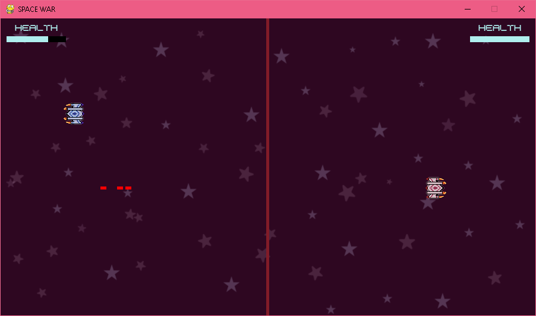

# Multiplayer-spaceshooters
This is a multiplayer space shooter game developed using Pygame. It features two spaceships battling against each other, with each player having their health bar. The objective is to eliminate the opponent by firing bullets while avoiding enemy bullets.

## How to Play

1. Clone the repository: `git clone https://github.com/your_username/space-war.git`
2. Install Pygame: `pip install pygame`
3. Run the game: `python space_war.py`

## Controls

- Player 1 (Blue Ship):
  - Move Up: W
  - Move Down: S
  - Move Left: A
  - Move Right: D
  - Fire: Left Ctrl

- Player 2 (Red Ship):
  - Move Up: Up Arrow
  - Move Down: Down Arrow
  - Move Left: Left Arrow
  - Move Right: Right Arrow
  - Fire: Right Ctrl

## Artwork

All artwork used in the game is created by Drishti Malavade. 
